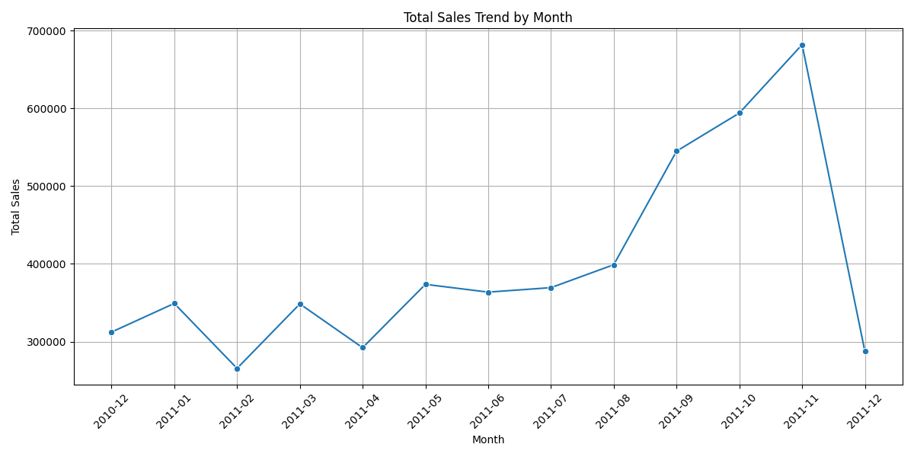
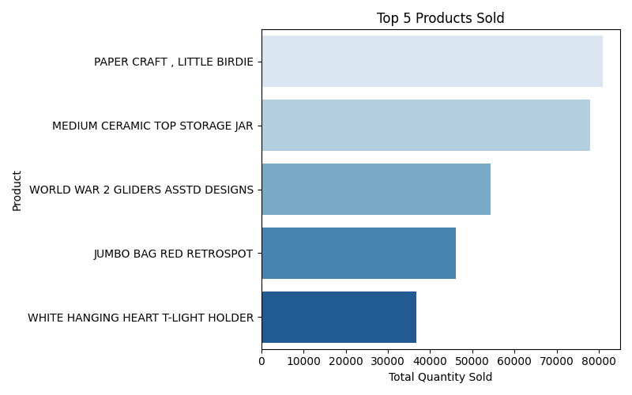
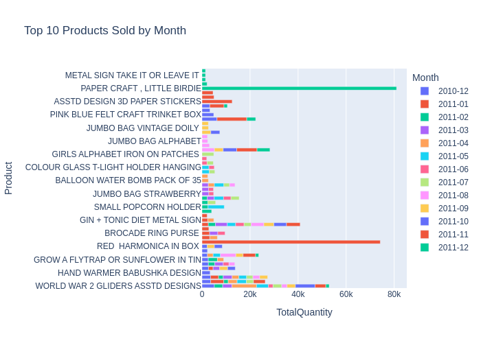

# Customer Buying Trend Analysis  
  


---

## Project Overview
This project analyzes **monthly top-selling products** based on retail transaction data to understand **buying trends and seasonal patterns**.  
The goal is to:
- Identify products in high demand each month.
- Understand seasonal effects (e.g., holiday season).
- Provide **data-driven recommendations** for inventory and marketing strategies.
- Showcase **data analytics and visualization** skills for portfolio purposes.

---

## Data Source
- **Source:** Internal retail dataset containing transaction records.
- **Key Features Used:**
  - `Month` – Year-Month of transaction (e.g., `2010-12`)
  - `Product` – Product description
  - `TotalQuantity` – Total units sold for that product in the given month
- **Coverage:**
  - December 2010 (holiday season)
  - January 2011 – December 2011 (full year, monthly top 10 products)

---

## Key Insights
1. **Seasonality Matters**: Holiday months (Nov–Dec) and post-holiday clearance (Jan) show significant sales spikes.
2. **Recurring Best Sellers**: Items like **WORLD WAR 2 GLIDERS** and **JUMBO BAG RED RETROSPOT** remain popular across months.
3. **Category Shifts**: Summer months see **DIY and event items**, while winter favors **holiday décor and gifts**.
4. **Outlier Sales Events**: Products like **PAPER CRAFT LITTLE BIRDIE (Dec 2011)** and **MEDIUM CERAMIC TOP STORAGE JAR (Jan 2011)** show unusual spikes.

---

## Recommendations
1. **Inventory Planning**
   - Stock up on **recurring best sellers** year-round.
   - Prepare holiday inventory by **October** and focus on décor/gift products.
2. **Promotional Strategy**
   - Promote **DIY/event items** in summer to balance off-season dips.
   - Run **holiday campaigns** starting in September for early shoppers.
3. **Product Bundling**
   - Bundle ornaments, crafts, and bags to increase off-season sales.
4. **Investigate Outliers**
   - Review why certain products saw abnormal spikes and replicate those promotions.

---

## Tech Stack
- Python: `pandas`, `matplotlib`, `seaborn`, `plotly`
- Jupyter Notebook for analysis
- GitHub Pages for hosting interactive charts (optional)

---

## How to Run
```bash
# Clone repository
git clone git@github.com:leo3622/customer_segmentation_analysis.git
cd customer_segmentation_analysis

# Download dataset from https://www.kaggle.com/datasets/vijayuv/onlineretail/data and place in `data/` folder

# Open analysis notebook
jupyter notebook customer_analysis.ipynb
```

---

## Visualizations
1. **Monthly Sales Trend**

    

2. **Top 5 Products Across All Months**

    

3. **Top Products by Month**

    

    [**Click here for interactive version**](imgs/top_products_by_month.html)

<details> <summary><b>Monthly Detailed Insights (Click to Expand)</b></summary>

**December 2010**
- **Top Products**
    - WORLD WAR 2 GLIDERS ASSTD DESIGNS (5,139)
    - WHITE HANGING HEART T-LIGHT HOLDER (3,611)
    - PACK OF 72 RETROSPOT CAKE CASES (3,572)
- **Observation:** Strong focus on gift items, home décor, and small accessories driven by holiday shopping.

 **January 2011**
- **Top Products**
    - MEDIUM CERAMIC TOP STORAGE JAR (74,215) (massive outlier)
    - WHITE HANGING HEART T-LIGHT HOLDER (5,467)
    - PACK OF 72 RETROSPOT CAKE CASES (3,329)

- **Observation:** Likely post-holiday restocking or clearance event driving unusually high sales.

 **February 2011**
- **Top Products**
    - EMPIRE DESIGN ROSETTE (3,986)
    - GROW A FLYTRAP OR SUNFLOWER IN TIN (3,795)

- **Observation:** Lower sales compared to January. Focus shifted toward gardening and novelty items, indicating seasonal transition.

 **March 2011**
- **Top Products**
    - JUMBO BAG RED RETROSPOT (4,924)
    - WORLD WAR 2 GLIDERS ASSTD DESIGNS (3,888)

- **Observation:** Bags, crafts, and novelty products became popular; early spring purchases increased activity.

 **April 2011**
- **Top Products**
    - WORLD WAR 2 GLIDERS ASSTD DESIGNS (10,224) (huge increase)
    - WHITE HANGING HEART T-LIGHT HOLDER (3,725)

- **Observation:** A noticeable spike in glider sales (possible promotion or seasonal toy demand).

 **May 2011**
- **Top Products**
    - SMALL POPCORN HOLDER (6,738)
    - WORLD WAR 2 GLIDERS ASSTD DESIGNS (4,944)

- **Observation:** Event and party supplies performed well, suggesting summer event prep.

 **June 2011**
- **Top Products**
    - JUMBO BAG RED RETROSPOT (3,529)
    - ASSORTED COLOURS SILK FAN (3,096)

- **Observation:** Slightly lower volumes overall, with demand shifting toward practical and gift items.

 **July 2011**
- **Top Products**
    - GIRLS ALPHABET IRON ON PATCHES (4,896)
    - WORLD WAR 2 GLIDERS ASSTD DESIGNS (3,600)

- **Observation:** Craft and customization items were strong, aligning with summer DIY activity.

 **August 2011**
- **Top Products**
    - ASSORTED COLOUR BIRD ORNAMENT (6,425)
    - JUMBO BAG RED RETROSPOT (5,278)

- **Observation:** Home décor and ornamental items drove sales, likely home refresh season purchases.

 **September 2011**
- **Top Products**
    - JUMBO BAG RED RETROSPOT (4,177)
    - 60 CAKE CASES VINTAGE CHRISTMAS (3,669)

- **Observation:** Early holiday baking products started to trend, indicating early Christmas preparation.

 **October 2011**
- **Top Products**
    - WORLD WAR 2 GLIDERS ASSTD DESIGNS (8,174)
    - RABBIT NIGHT LIGHT (6,249)

- **Observation:** Pre-holiday buildup begins, gift items and home lighting surge.

 **November 2011**
- **Top Products**
    - ASSTD DESIGN 3D PAPER STICKERS (12,551)
    - RABBIT NIGHT LIGHT (12,393)

- **Observation:** Holiday decorating items and lighting dominate; clear holiday preparation behavior.

 **December 2011**
- **Top Products**
    - PAPER CRAFT, LITTLE BIRDIE (80,995) (massive outlier)
    - POPCORN HOLDER (5,362)

- **Observation:** Heavy holiday crafting and DIY decoration activity. The spike in PAPER CRAFT LITTLE BIRDIE likely reflects a single product promotion or bulk sale.
</details>